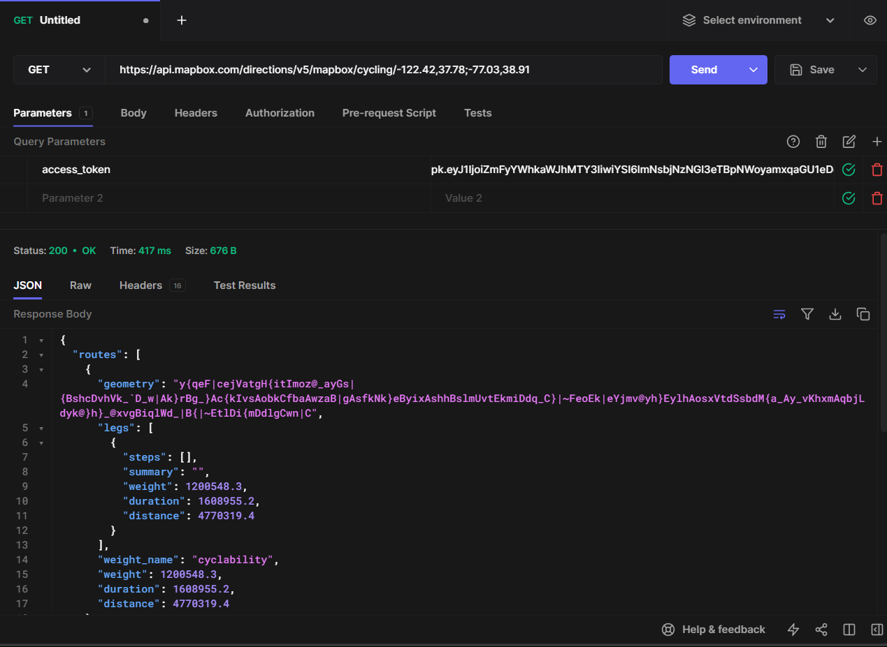
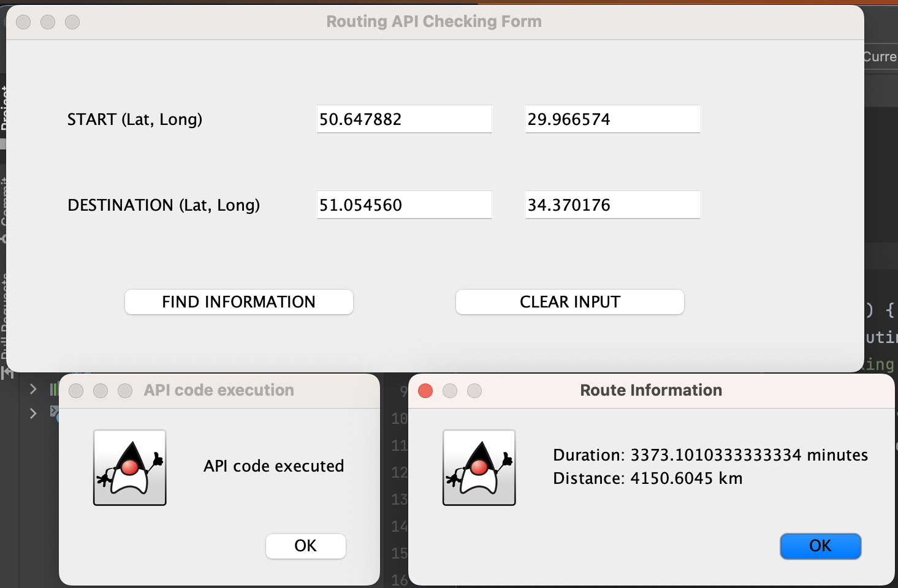

# README

## Description

**Project domain:** 

Our project domain is location-based services and navigation, including 
social-networking. This is similar to Google Maps, where users will be provided with 
an interactive map where they can search/navigate to places. The social-networking aspect
is where users can share their data to others, such as hosting/attending events.

**Brief high-level description:**

Our application will present a map to the user. If the user wants to host an event,
he/she can do it by adding the event on the map (click the place on the map 
and input time and other details). If the user wants to instead attend some event 
(for example they want to find a place to play volleyball with others on the weekend), 
then they can open the application and choose among the available events going on.

In this way, our application will provide an opportunity for users to share offline events
on an interactive map. They can choose to host a new event, or attend current ones hosted 
by other users.

**List of any technical problems blocking progress:**
- While the Mapbox web services provides apis for map data, such as static images and map vector tiles,
we have yet to decide how we want to embed this data to produce an interactive map in our java code.

## API

The API we are going to be using is Mapbox Web Services apis, link: https://docs.mapbox.com/api/overview/. 
The API provides us with map data, such as static images for the map, directional data, and so on.

The example below is calling the Mapbox Directions Api (https://docs.mapbox.com/api/navigation/directions/),
which takes in two places and returns a json file of the directions to follow to get from one place to another.

Currently, we have also been able to send requests to the API from our java code. 
In the image below, we input two coordinates, where we are and where we want to go, in
latitude and longitude values. 

The api call returns a json file of distance and duration 
between points in the route. We can add these values to get the total distance and duration 
for our trip.

